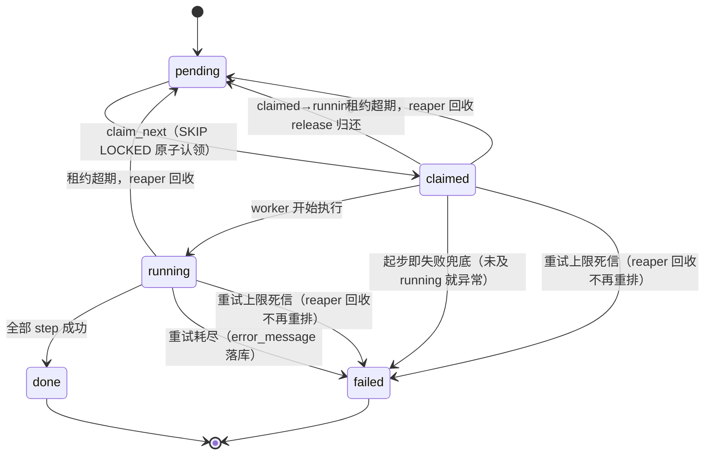

# 任务调度看板

Python（Flask + psycopg 3）+ PostgreSQL：三层参数合并、并发认领、幂等 step 日志、单文件状态看板。并发正确性全部下沉到 PostgreSQL 行锁与唯一约束，**零外部中间件**。

**亮点速览**
- 零重复认领实测：10 真进程 × 10 轮 × 100 任务，`duplicate_claims=0`（[攻击日志](evidence/claim_attack_run.log)）
- 默认集 122 用例（排除 slow）/ 全量 123（含攻击测试），真库全绿
- 幂等 first-report-wins：主键 + `ON CONFLICT DO NOTHING`，结构性保证、无应用层判断
- Docker 一键：`docker compose up --build` 即得 postgres/seed/api/worker 全套

**实际耗时：约 12 小时**（口径：git 首末提交自然跨度 2026-08-18 23:29 → 2026-08-19 11:31，含规划/验证/答辩准备；纯编码时段见 `git log`）

**语言选择**：Python，最熟练。并发正确性全部下沉到数据库行锁与唯一约束，应用层不持有分布式状态；本规模（≤10 worker、≤5 TPS）用不上 MQ/Redis。

## 快速开始
```bash
# Docker（零本机依赖）
docker compose up --build                       # postgres → seed → api → worker 依次就绪
# 看板 http://127.0.0.1:5000；收尾 docker compose down

# 裸机（Python 3.12 + 本机 PostgreSQL）
python -m venv .venv && .venv\Scripts\python.exe -m pip install -r requirements.txt
createdb taskboard && copy .env.example .env    # Linux/macOS 用 cp；在 .env 填入 DATABASE_URL
.venv\Scripts\python.exe -m board.seed && .venv\Scripts\python.exe -m board.worker --id W1
.venv\Scripts\python.exe -m board.api           # 打开 http://localhost:5000
```

<details>
<summary>完整启动步骤与环境变量表（展开）</summary>

裸机：seed 播种（`--reset` 破坏性重建）；第二终端再起一个 `--id W2` worker 即双 worker 并行。

| 变量 | 作用 | 缺省 |
|---|---|---|
| `DATABASE_URL` | PostgreSQL 连接串 | 无（必填，或 .env） |
| `LEASE_SECONDS` | 任务租约秒数（超期由 reaper 回收） | 60 |
| `API_TOKEN` | 设置后 `/api` 强制 Bearer 认证 | 未设（仅 127.0.0.1 口径） |
| `API_HOST` | API 监听地址 | 127.0.0.1 |
| `TB_WSGI_THREADS` | waitress 线程数 | 8 |
| `TB_CONNECT_TIMEOUT` / `TB_LOCK_TIMEOUT_MS` / `TB_STATEMENT_TIMEOUT_MS` | 连接/锁/语句超时 | 见 board/db.py |
| `TB_STRICT_DB` | =1 时测试隔离库供给失败大声 fail | 关 |
| `WATCHDOG_PYTHON` | watchdog 拉子进程用的解释器 | .venv 内 python |

</details>

## 架构简述
- 参数合并：L1 base / L2 group / L3 step 三层粘性折叠，L3 `""` 为"不覆盖"哨兵。
- 并发认领：单条原子 UPDATE + `FOR UPDATE SKIP LOCKED`；任务状态唯一写者是 worker。
- 幂等：step_logs 主键 `(task_id, step_index)` + `ON CONFLICT DO NOTHING`，first-report-wins。
- 租约回收：超期任务由 reaper 回收重跑，状态流转与日志写入带 owner/epoch 围栏。



## 参数"当前生效值"的演变
起点 = base ⊕ L2；之后逐 Step 粘性推进，L3 `""` 保留当前值、不回跳 base。例：base={a:1,b:2,c:3}，L2={a:10,d:4}：

| Step | L3 override | 生效快照 |
|---|---|---|
| 1 | {b:20, e:""} | {a:10,b:20,c:3,d:4}（e 未定义过，保持不存在） |
| 2 | {a:"", c:""} | 同上（哨兵跳过） |
| 3 | {a:100} | {a:100,b:20,c:3,d:4} |
| 4 | {} | 同上 |

## 并发证据
`scripts/attack_claim.py` spawn 10 真进程攻击：判定 = 队列回传 id 去重 + DB 计数双向核对 + 参与度核对；全量口径另含组合轮/洪泛轮深验，细节见 [COLLAB.md](COLLAB.md)。

| workers | rounds | tasks | duplicate_claims | 结果 | 日志 |
|---|---|---|---|---|---|
| 10 | 10 | 1000 | **0** | PASS | [evidence/claim_attack_run.log](evidence/claim_attack_run.log) |

## 边界情况
- `""` 哨兵：仅精确 `""`（假值 0/False/None 不是）；L3 `""` 保留当前粘性值不回跳，L2 `""` 是字面值；作用于未定义 key 则 key 保持不存在。
- 嵌套 dict override 整体替换、非深合并（刻意取舍，有测试锁定）；step_index 可不连续，按真实序号上报。

## 测试与验证
- 本地默认 `pytest`：默认集 122（排除 slow）；`pytest -m ""` 全量 123（含攻击测试）。无 PostgreSQL 时 DB 用例自动 skip 并打印"假绿警告"。覆盖率不设 fail-under，待 CI 基线实测后回填。
- CI：GitHub Actions postgres:14 service + `TB_STRICT_DB=1` 全量跑，pytest 输出/junit/coverage 归档 artifact（保留 30 天）。
- 看板 E2E：并发 5 次上报全去重、竞速失败如实渲染。更多见 [COLLAB.md](COLLAB.md)。

## 砍掉清单
连接池、回收后断点续跑、嵌套深合并、WebSocket、迁移框架——均为与本规模不匹配或刻意取舍，逐项理由见 COLLAB.md。（鉴权已以 opt-in `API_TOKEN` 形式补齐。）

## 细则索引
- 部署形态取舍 / 信任边界细则 / API 契约变更声明 / Docker 详命令与数据生命周期 / 目录约定 → [docs/operations.md](docs/operations.md)
- 验证细节 / 历轮修复清单 / AI 纠错案例 → [COLLAB.md](COLLAB.md)
