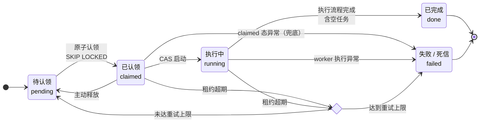

# 任务调度看板

kGroup 笔试题一（全栈方向）：多 worker 任务调度系统的后端 + 极简状态看板。技术栈 Python（Flask + psycopg 3）+ PostgreSQL，并发正确性全部交给数据库的行锁和唯一约束，没有引入任何外部中间件。

**实际耗时**：约 16 小时（git 首末提交 2026-08-18 23:29 → 2026-08-19 15:31，含规划、开发、验证与文档整理；过程见 `git log`）。

## 语言与数据库选择

- 选 Python 因为它是我最熟练的语言。并发安全不依赖语言运行时——全部下沉到数据库，应用层不持有共享状态，GIL 因此不构成威胁。
- 怎么保证并发测试是"真实并发"：Python 的线程和 asyncio 正是题目点名的语言层伪并发，所以攻击脚本用 multiprocessing spawn 出 10 个独立进程，各建各的数据库连接同时抢任务，和真实部署里多进程/跨机器 worker 是同一形态。
- 数据库选 PostgreSQL 而不是 SQLite：认领逻辑建立在 `FOR UPDATE SKIP LOCKED` 的行级锁上，这本来就是客户端-服务器数据库的能力，也省去"换到 PG 后是否依然成立"的论证。

## 快速开始

```bash
# Docker（零本机依赖）
docker compose up --build      # postgres → seed → api → worker 依次就绪
# 看板 http://127.0.0.1:5000；收尾 docker compose down

# 裸机（Python 3.12 + 本机 PostgreSQL）
python -m venv .venv && .venv\Scripts\python.exe -m pip install -r requirements.txt
createdb taskboard && copy .env.example .env       # Linux/macOS 用 cp；在 .env 填 DATABASE_URL
.venv\Scripts\python.exe -m board.seed             # 建表并播种演示任务
.venv\Scripts\python.exe -m board.worker --id W1   # 第二个终端再起 --id W2 即双 worker
.venv\Scripts\python.exe -m board.api              # 打开 http://localhost:5000
```

<details>
<summary>环境变量表（展开）</summary>

seed 默认非破坏（只在空库播种）；`--reset` 显式清库重建。完整变量清单（含 PORT、TB_TEST_DB、TB_LOG_FILE 等）见 .env.example。

| 变量 | 作用 | 默认 |
|---|---|---|
| `DATABASE_URL` | PostgreSQL 连接串 | 必填（可写在 .env） |
| `LEASE_SECONDS` | 任务租约秒数，超期由 reaper 回收 | 60 |
| `API_TOKEN` | 设置后 `/api` 全部要求 Bearer 认证 | 未设（默认仅监听本机） |
| `API_HOST` | API 监听地址 | 127.0.0.1 |
| `TB_WSGI_THREADS` | waitress 线程数 | 8 |
| `TB_POOL_MIN` / `TB_POOL_MAX` | API 连接池保底/上限 | 1 / 8 |
| `TB_CONNECT_TIMEOUT` / `TB_LOCK_TIMEOUT_MS` / `TB_STATEMENT_TIMEOUT_MS` | 连接 / 锁 / 语句超时 | 见 board/db.py |
| `TB_STRICT_DB` | =1 时测试隔离库不可用直接报错而非 skip | 关 |
| `WATCHDOG_PYTHON` | watchdog 拉起子进程用的解释器 | .venv 内 python |

</details>

## 架构简述

四个硬性需求对应四块实现：

1. **参数合并**（board/params.py）：纯函数。起点是 base 合入 group override，之后逐 step 折叠 L3——某个 key 一旦被覆盖，新值带给后续所有 step（粘性）；L3 里 `""` 表示"本步不覆盖"，保留当前生效值而不是回跳 base。
2. **并发认领**（board/claim.py）：一条 `UPDATE ... WHERE id = (SELECT ... FOR UPDATE SKIP LOCKED)` 原子完成认领。行锁保证同一行同一时刻只属于一个事务，其它 worker 直接跳过锁定行；不做"先 SELECT 再 UPDATE"，两步之间就是竞态窗口。
3. **幂等日志**（board/logs.py）：step_logs 主键 `(task_id, step_index)` + `ON CONFLICT DO NOTHING`，先到先得。重复上报被主键挡下；代码里没有 UPDATE 路径，后到的上报想把成功改成失败也无从下手。
4. **看板**（static/index.html）：单文件页面，2 秒轮询（失败时指数退避）。每个 running 任务带"并发上报 ×5"按钮，5 个并行 POST 打向同一 step，面板显示收到 5 条、实际至多落库 1 条，现场演示幂等。

容错：认领时间兼作租约，worker 用独立心跳线程续租；超期任务由 reaper 收回 pending 重新排队，达到重试上限则进 failed 死信。被夺权的旧 worker 后续所有写操作都因 `(claimed_by, claim_epoch)` 围栏对不上而落空。



## 参数"当前生效值"的演变

例：base = {a:1, b:2, c:3}，group override = {a:10, d:4}，起点即 {a:10, b:2, c:3, d:4}：

| Step | L3 override | 生效快照 |
|---|---|---|
| 1 | {b:20, e:""} | {a:10, b:20, c:3, d:4}（e 从未定义，保持不存在） |
| 2 | {a:"", c:""} | 同上——`""` 全部跳过，a 保持 10 而不是回跳 1 |
| 3 | {a:100} | {a:100, b:20, c:3, d:4} |
| 4 | {} | 同上（粘性延续） |

边界用例集中在 tests/test_params.py（30 个）。

## 并发测试证据

`scripts/attack_claim.py`：10 个 spawn 进程 × 10 轮 × 每轮 100 任务。判重不靠查库里有没有重复行（tasks.id 是主键，重复行结构上不可能出现，那是死检查），而是把各进程回传的认领 id 合并去重、与库内计数双向核对，再看 claimed_by 分布确认各进程真的都抢到了活。

| workers | rounds | tasks | duplicate_claims | 结果 |
|---|---|---|---|---|
| 10 | 10 | 1000 | **0** | PASS（[完整日志](evidence/claim_attack_run.log)） |

测试：本地 `pytest` 默认 122 个用例（排除慢速攻击用例），`pytest -m ""` 全量 123；无 PostgreSQL 时 DB 用例自动 skip 并打警告。CI（GitHub Actions + postgres:14）跑全量并归档输出。

## 发现的边界情况

- `""` 哨兵只认精确空字符串，0 / False / None 都是正常值照常覆盖；`""` 作用于从未定义的 key 时，该 key 保持不存在。
- L2 的 `""` 是字面值、L3 的 `""` 是哨兵，两层语义刻意不对称，有测试锁定。
- 嵌套 dict override 整体替换、不做深合并——刻意取舍，同样有测试锁定。
- step_index 允许不连续（1/3/7 也合法），上报与推进都按真实序号走。
- 手动上报会和 reaper 回收竞态：report 端点的状态读加 `FOR UPDATE`，行锁保持到日志落库提交，与回收互斥。
- first-report-wins 的代价：瞬时失败后重试成功，日志仍永远记为失败。对策是失败必落库且可观测（error_message 列），不静默吞掉。

## 砍掉了什么、为什么

- **回收后断点续跑**：回收任务整体重跑，已完成 step 被幂等主键自动挡下；真续跑要持久化 step 级游标，复杂度与收益不成比例。
- **WebSocket**：这个数据量下 2 秒轮询和推送没有体验差别。
- **嵌套参数深合并、迁移框架**：与规模不匹配；整体替换 + schema.sql 幂等重建够用。（鉴权未砍，以 opt-in `API_TOKEN` 形式提供。）

补充材料：
验证细节与 AI 纠错案例见 [COLLAB.md](COLLAB.md)；
部署形态、信任边界、API 契约等运维细则见 [docs/operations.md](docs/operations.md)。
